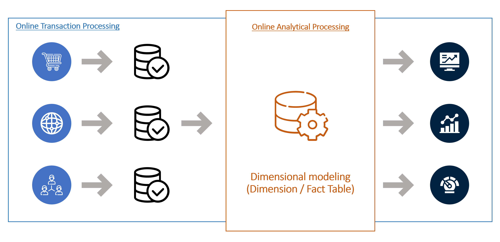
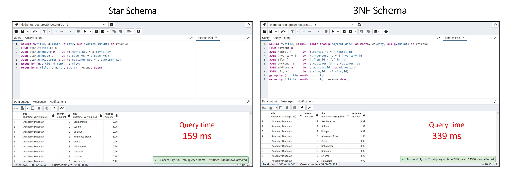

# Building Data Models In PostgreSQL

## Objective

This is a personal data engineering project attempted to build data models.

It focuses on creating tables in postgresql database and inserting data to the database using Python. Additionally, we combine tables from a complex 3 NF schema to build a simpler star schema and compare query time complexity.

The tools used in this project include [Python](https://www.python.org/downloads/), [PostgreSQL](https://www.postgresql.org/download/), and [Jupyter Notebook](https://www.anaconda.com/products/distribution).

NOTE: Kindly remember the password to be created whilst installing PostgreSQL; it'll be required to connect to the database.

### 1. Creating a table with Postgres

Please refer to [the project notebook](build_data_model.ipynb) for step by step process on how to create tables, insert values, and query tables on PostgreSQL using Python.

### 2. Relational Databases vs Data Warehouse

Relational database systems like PostgreSQL are efficient for storing and retrieving data compared to other systems. In RDBMS, data is organized in tables which group together related objects. Each row is an instance of the object the table holds. Each column is a field inofrmation. Tables, rows, and columns are defined by a schema, which is a definition of all the components in the database.

Databases often serve as the back end of Online Transaction Processing (OLTP) systems, in which data is added, modified, and deleted one record at a time. For example, for an e-Commerce website, the underlying database system for processes - including a user creation, address addition, or removing an expired product from cart - can be built off OLTP. These are transactional processes revolving around an individual and unique elements of data generation. This process is primarily concerned with recording the current state of a subject and involves small but frequent units of work.

However, not all systems are transaction-based. For example, if the sales team wants to realize the trend of sales over time, it wouldn't be necessary to know the values of individual records. They'll need aggregated information; hence, the need for an application-centric system or Online Analytical Processing (OLAP) system. Modern OLAP systems are applicable in Big Data because they use distributed computing systems that can scale to handle complex analytical processing across large datasets. 

The tool advisable for this type of complex system is a Data Warehouse. Examples of modern data warehouses include Amazon Redshift, Google BigQuery, Snowflake, and Microsoft Synapse.

A data warehouse is similar to RDBMS, but where data are stored by rows in databases, data in data warehouses are stored by columns.
A row-based database system won't give you the performance needed for data analytics with high volume of data.

### Building a Star schema from a 3NF relational database model

This section aims to convert a complex 3NF schema of a relational database to a simpler star schema model for a data warehouse. Finally, we run an analytical query to compare both system's time complexity.

In this exercise, we'll user a PostgreSQL sample database. The DVD rental database represents the business processes of a DVD rental store. More information about the database and the download link can be found [here](https://www.postgresqltutorial.com/postgresql-getting-started/postgresql-sample-database/).

To load the DVD rental database to local PostgreSQL server after downloading, follow the instruction [here](https://www.postgresqltutorial.com/postgresql-getting-started/load-postgresql-sample-database/).

The above is the ER model of our dvdrental database. It takes the structure of a third normal form (3NF). This model is considered adequate for normal relational database design becasue most of the tables are free of insertion, update, and deletion anomalies. However, if we intend to build a near real-time analytical dashboard that displays DVD rentals over time for the concerned team, querying the database will become inefficient with increasing data size. Hence, the need for a simpler data model, in this case, a star schema.

#### Dimensional Modeling: Fact and Dimension Table

In building our schema design, two table concepts will play a significant role as they will be the foundation of our new database model.

A dimension table contains descriptive attribute fields whereas a fact table contains only measures and key relationships. A Fact table is the central table in a star schema of a data warehouse and is key in aggregating specific measures to provide a cetain level of detail.

The attribute format of fact table is in numerical format and text format, while that of the dimension table is in text format.

#### Schema Design Thinking

To convert our complex data model to a simpler one, we need to identify KEY descriptive attributes that'll make up our dimension table. The primary key column in these dimension tables as well as our measure column, will form our fact table.

From the ER model of our DVD rental database, we can tell that attributes such as customers' city, country, and address could be lumped together in one table. Similarly, film category, title, and language, do not need to be stand alone tables.

On this basis, we go ahead to generate queries that'll eventually form the structure of our star shema as shown below. 

The queries that creates and inserts values to the dimension and fact tables seen above can be found [here](queries.txt).

#### Query Time Comparison

In comparing the query time to extract data from our models, we'll attempt to return the monthly aggregated sales amount of each movie in every city. Again, this query can be found in the link above.

### Conclusion

Conclusively, we may observe that the query time saved between the two models isn't distinguished and this can be attributed to the size of our data - relatively small. However, with increasing data size, the time and space complexity is expected to increases exponentially. 

Finally, to avoid running out of resources when executing complex queries in large databases, especially for analytical purposes (OLAP), we need to ensure that the underlying database model is built like a star schema in a data warehouse rather than a relational database model.

If you have questions regarding this project, please do [send me a mail](mailto:chidindego@gmail.com) and thanks for your time. 

### Reference

- [Psycopg Documentation](https://www.psycopg.org/docs/)
- [Data Warehouse vs Database](https://www.fivetran.com/blog/data-warehouse-vs-database)
- [Understanding the difference between OLTP and OLAP](https://www.fivetran.com/blog/oltp-vs-olap-what-is-the-difference?_gl=1*ym12pv*_ga*MTc2MjEwMTk3NS4xNjc0Mjg4NDI3*_ga_NE72Z5F3GB*MTY3NDI4ODQyNy4xLjAuMTY3NDI4ODQyNy4wLjAuMA..)
- [Why you shouldn't use Postgres or MySQL as your data warehouse](https://www.fivetran.com/blog/why-you-shouldnt-use-postgres-data-warehouse?_gl=1*1a24cbl*_ga*MTc2MjEwMTk3NS4xNjc0Mjg4NDI3*_ga_NE72Z5F3GB*MTY3NDI5Mzc5MS4yLjEuMTY3NDI5NDE1NS4wLjAuMA..)
- [Third Normal Form (3NF)](https://www.geeksforgeeks.org/third-normal-form-3nf/)
- [Fact Table vs Dimension Table: The Differences](https://allthingssql.com/fact-table-vs-dimension-table/)
- [Data Warehouse Requirement Gathering](https://www.selecthub.com/business-intelligence/data-warehouse-requirements-gathering/)